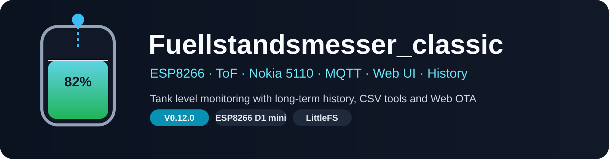

<p align="center">
  
</p>

# Fuellstandsmesser_classic

[Deutsch](#deutsch) · [English](#english)

## Deutsch

`Fuellstandsmesser_classic` ist ein kompakter, eigenständiger Füllstandsmesser für Heizöl- und andere Tanks auf Basis eines **ESP8266 D1 mini**. Unterstützt werden VL53L0X/VL53L1X, Nokia 5110, MQTT, Weboberfläche, Langzeit-Historie, CSV Import/Export und Web OTA.

> **Aktueller Entwicklungsstand:** V0.12.3 I18N FIX3  
> **Sprachen:** Deutsch / Englisch, beim Kompilieren auswählbar  
> **Zielhardware:** ESP8266 D1 mini

### Sprache auswählen

In `firmware/Fuellstandsmesser_classic/Language.h`:

```cpp
#define APP_LANGUAGE LANGUAGE_DE
```

oder:

```cpp
#define APP_LANGUAGE LANGUAGE_EN
```

Die sichtbaren Texte liegen getrennt in `languages/lang_de.h` und `languages/lang_en.h`. Weitere Sprachen können später ergänzt werden. MQTT-Topics, API-/JSON-Feldnamen sowie Config- und History-Formate bleiben sprachunabhängig.

### Hardware

| Gerät | Adresse | Anschluss |
|---|---:|---|
| VL53L0X / VL53L1X | `0x29` | SDA=D2 / SCL=D1 |
| AHT10 optional | `0x38` | SDA=D2 / SCL=D1 |

| Nokia 5110 | D1-mini-Pin |
|---|---|
| CLK | D5 |
| DIN | D7 |
| DC | D4 |
| CS | D6 |
| RST | D3 |

### MQTT-Kompatibilität

| Topic | Bedeutung |
|---|---|
| `average` | Tankinhalt in Litern |
| `fuellhoehe` | gefilterter ToF-Sensorabstand in mm |

`fuellhoehe` ist aus Kompatibilitätsgründen weiterhin der Sensorabstand, nicht die berechnete Flüssigkeitshöhe.

### Installation

Arduino IDE 2.x, ESP8266 Arduino Core 3.1.2 und die Libraries Adafruit GFX, Adafruit PCD8544, Adafruit VL53L0X, Adafruit VL53L1X und PubSubClient verwenden. Sketch: `firmware/Fuellstandsmesser_classic/Fuellstandsmesser_classic.ino`.

### Dokumentation

- [Hardware & Verdrahtung / Hardware & wiring](docs/HARDWARE.md)
- [Installation & Build](docs/INSTALLATION.md)
- [Architektur / Architecture](docs/ARCHITECTURE.md)
- [Sprachen / Languages](docs/LANGUAGE.md)
- [Web UI](docs/WEB_UI.md)
- [MQTT](docs/MQTT.md)
- [History & CSV](docs/HISTORY_CSV.md)
- [CLI](docs/CLI.md)
- [Fehlersuche / Troubleshooting](docs/TROUBLESHOOTING.md)
- [Sicherheit / Safety](docs/SAFETY.md)
- [Changelog](CHANGELOG.md)

### Sicherheit

Die Weboberfläche besitzt keine allgemeine Benutzer-Authentifizierung. Gerät nur in einem vertrauenswürdigen LAN betreiben. Dieses Hobbyprojekt ist kein zertifiziertes Mess-, Sicherheits-, Alarm-, Überfüll-, Leckage- oder Überwachungssystem.

---

## English

`Fuellstandsmesser_classic` is a compact standalone tank-level monitor for heating-oil and other tanks based on an **ESP8266 D1 mini**. It supports VL53L0X/VL53L1X, Nokia 5110, MQTT, a web interface, long-term history, CSV import/export and Web OTA.

> **Current development state:** V0.12.3 I18N FIX3  
> **Languages:** German / English, selected at compile time  
> **Target hardware:** ESP8266 D1 mini

### Select the language

In `firmware/Fuellstandsmesser_classic/Language.h`:

```cpp
#define APP_LANGUAGE LANGUAGE_DE
```

or:

```cpp
#define APP_LANGUAGE LANGUAGE_EN
```

User-facing strings are separated into `languages/lang_de.h` and `languages/lang_en.h`. More languages can be added later. MQTT topics, API/JSON field names and Config/History formats remain language-independent.

### Hardware

| Device | Address | Connection |
|---|---:|---|
| VL53L0X / VL53L1X | `0x29` | SDA=D2 / SCL=D1 |
| optional AHT10 | `0x38` | SDA=D2 / SCL=D1 |

### MQTT compatibility

| Topic | Meaning |
|---|---|
| `average` | tank content in liters |
| `fuellhoehe` | filtered ToF sensor distance in mm |

For compatibility, `fuellhoehe` remains the sensor distance, not the calculated liquid height.

### Installation

Use Arduino IDE 2.x, ESP8266 Arduino Core 3.1.2 and the libraries Adafruit GFX, Adafruit PCD8544, Adafruit VL53L0X, Adafruit VL53L1X and PubSubClient. Sketch: `firmware/Fuellstandsmesser_classic/Fuellstandsmesser_classic.ino`.

### Security

The web interface has no general user authentication. Operate the device only on a trusted LAN. This hobby project is not a certified measurement, safety, alarm, overfill, leak-detection or monitoring system.
