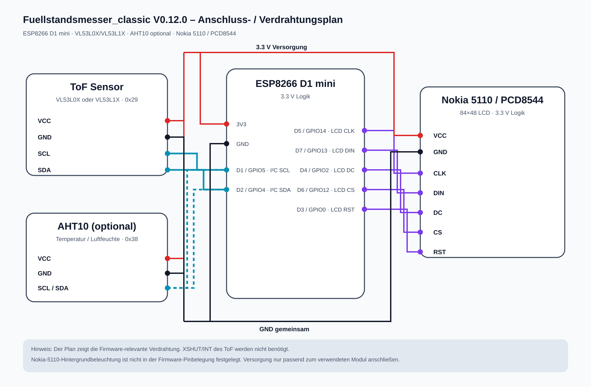

# Fuellstandsmesser_classic – Hardware & Verdrahtung

## Controller

ESP8266 D1 mini, 4 MB Flash.

## I²C

| Signal | D1 mini | GPIO |
|---|---:|---:|
| SDA | D2 | GPIO4 |
| SCL | D1 | GPIO5 |

## Sensoren

| Gerät | Adresse | Hinweise |
|---|---:|---|
| VL53L0X / VL53L1X | 0x29 | ToF-Füllstandssensor |
| AHT10 optional | 0x38 | Temperatur / Feuchte |

## Nokia 5110 / PCD8544

| Display-Signal | D1-mini-Pin | GPIO |
|---|---:|---:|
| CLK | D5 | GPIO14 |
| DIN | D7 | GPIO13 |
| DC | D4 | GPIO2 |
| CS | D6 | GPIO12 |
| RST | D3 | GPIO0 |

## Prinzipverdrahtung

    D1 mini
    D2 / GPIO4 ---- SDA ---- ToF + AHT10
    D1 / GPIO5 ---- SCL ---- ToF + AHT10

    D5 ------------ CLK ---- Nokia 5110
    D7 ------------ DIN ---- Nokia 5110
    D4 ------------ DC  ---- Nokia 5110
    D6 ------------ CS  ---- Nokia 5110
    D3 ------------ RST ---- Nokia 5110

## Hinweise

- ESP8266-Logik arbeitet mit 3,3 V.
- Versorgung der Breakout-Boards nach deren Spezifikation prüfen.
- gemeinsame Masse verwenden.
- ToF möglichst senkrecht zur Oberfläche montieren.
- Reflexionen an Tankwänden und Einbauten vermeiden.
- nach mechanischen Änderungen neu kalibrieren.

