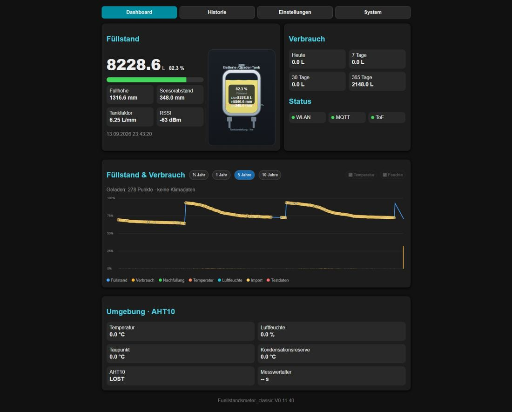
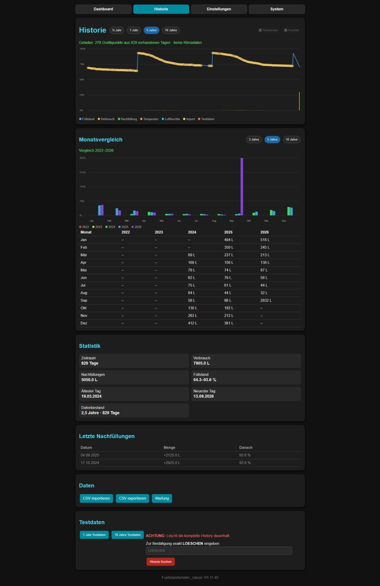
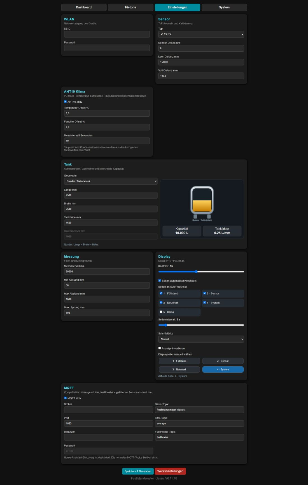
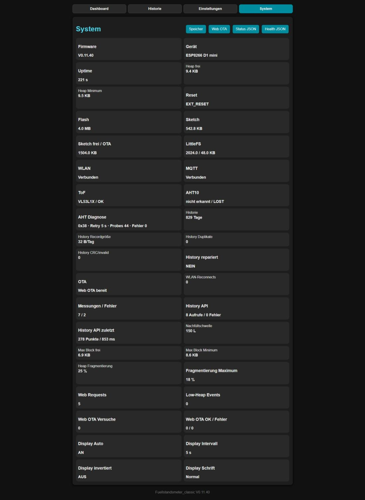

# Weboberfläche / Web UI

## Deutsch

Die Weboberfläche besteht aus vier Hauptseiten:

### Dashboard
- aktueller Füllstand in Litern und Prozent
- Füllhöhe, Sensorabstand, Tankfaktor und RSSI
- Verbrauchsübersicht
- Status von WLAN, MQTT und ToF
- Langzeitdiagramm für Füllstand & Verbrauch
- optionaler AHT10-Klimabereich

### Historie
- Verlauf über 1/2 Jahr, 1 Jahr, 5 Jahre, 10 Jahre
- Monatsvergleich
- Statistik
- letzte Nachfüllungen
- CSV-Import/-Export
- Wartungsfunktionen und Testdaten

### Einstellungen
- WLAN
- Sensorauswahl und Kalibrierung
- AHT10-Klima
- Tankgeometrie
- Messung / Filter
- Display-Konfiguration
- MQTT

### System
- Firmware- und Geräteinformationen
- Heap- und Speicherdiagnose
- WLAN-, MQTT-, ToF- und AHT10-Status
- History- und API-Diagnosen
- Web-OTA und weitere Wartungszugänge

## English

The web interface consists of four main pages:

### Dashboard
- current level in liters and percent
- liquid height, sensor distance, tank factor and RSSI
- consumption summary
- Wi-Fi, MQTT and ToF status
- long-term level & consumption chart
- optional AHT10 climate section

### History
- history ranges for 1/2 year, 1 year, 5 years, 10 years
- monthly comparison
- statistics
- recent refills
- CSV import/export
- maintenance tools and test data

### Settings
- Wi-Fi
- sensor selection and calibration
- AHT10 climate
- tank geometry
- measurement / filtering
- display configuration
- MQTT

### System
- firmware and device information
- heap and storage diagnostics
- Wi-Fi, MQTT, ToF and AHT10 status
- history and API diagnostics
- Web OTA and additional maintenance access

